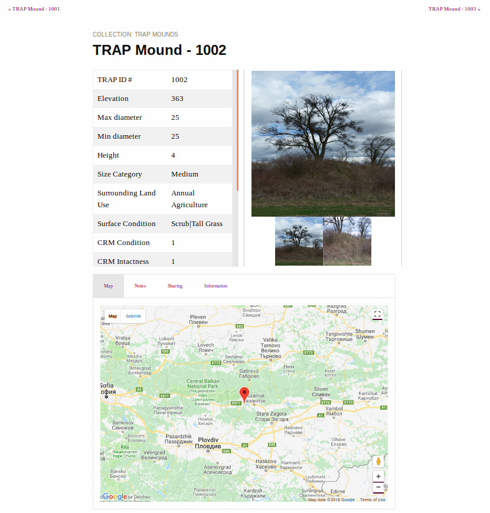

# Introduction
This is a template that uses [_Jekyll_](https://jekyllrb.com/) and based off [feeling-responsive](https://github.com/Phlow/feeling-responsive-v2) theme by Phlow. To get the basic structure, please follow the steps in this README. It is assumed that the user have basic knowledge of _Jekyll_ if not, please refer to https://jekyllrb.com/docs/home/ for more information.

The purpose of this project is to generate a data-driven website from a CSV. For the purpose of this project, each row in the CSV will be considered a `record`, and a page for each record will be called a `record page` and that a [_post_](https://jekyllrb.com/docs/posts/) in Jekyll is in our case a `record page`. The columns of the csv will each be refered to as a `attribute`.

# Overview
This section will briefly discuss the important steps required to use this project to create a website.

1. Configuring the project such as the title of the project, the logo, navigation bar that appears at the top of the page. Refer to [configuration](#configuration) section for more information.
2. Using the _record.html_ located inside the _\_layouts_ as a template, work through the file and change it according to your requirements.
3. Auto generate Record pages using the script provided.

## Prerequisites
Need to have `Python 3.5.2` installed to run the script and also have `Jekyll` installed to test the website locally. It is also assume that you are using Ubuntu if you wish to test your website locally before uploading to Github Pages.

*NOTE*: If users do not have required Python Modules and attempt to run the Python scripts provided, they will receive errors, please install the required Python modules that are missing. Please refer to https://docs.python.org/3/installing/index.html if you need more information.

### Required Python modules
The required modules to run the script is in the `requirements.txt` file. Please download the modules listed in that file.

### Installing Jekyll
Please refer to [Jekyll offical documentation](https://jekyllrb.com/docs/installation/) for instructions to install Jekyll on your system.

If you are using a Windows system, please refer to the page regarding installing [Jekyll on Windows](https://jekyllrb.com/docs/installation/windows/).

## Running Jekyll locally
Assuming jekyll is installed, to see your website locally, open up the terminal at the root of the folder of the project. Type in the following command then press enter

`bundle exec jekyll serve --config _config.yml,_config_dev.yml`

Another option is to run the shell script _local_jekyll_build.sh_ located at the root path of this project.

## Configuration
The \__config.yml_ file contains configuration options for the website. For basic configuration, do the following steps.

1. Open the \__config.yml_ file and work through it.
    * The main front matter variables for basic customisation is:
        * _title_
        *  _slogan_
        *  _descripton_
        *  _credits_
        *  _author_
        *  _url_
        *  _baseurl_.
More details can be found on https://help.github.com/articles/configuring-jekyll/ and https://jekyllrb.com/docs/configuration/.
	* *NOTE*: If you are running jekyll locally to see your changes, please stop the server then run it again to see changes made in your _\_config.yml_ file
	* If the user wish to add more custom data that can be accessed throughout the site via the Liquid templating system, then rather adding it directly into \__config.yml_ file, users are recommended to add it into the _additional\_config.yml_ file which is located in the \__data directory.
	* For example the variable _google-map-marker_ can be accessed via `site.data.additional_config.google-map-marker`.
	* More information is contained here: https://jekyllrb.com/docs/datafiles/

2. Add your _logo.png_ (if you have one) to _/assets/img/_.

3. Open \__data/socialmedia.yml_ and add your own social media links.

4. Open \__data/navigation.yml_ and customize your navigation.
	A navigation link composed of components, _title_, _url_, _side_.
	_title_ is the name of the link
	_url_ is the relative link to the page.		
	_side_ is whether the link would be located on the left-hand or right-hand side of the navigation bar. It is recommended to put it all in the left hand side to keep the *Search* bar at its current location.

5. Open \__data/language.yml_ and translate the theme if necessary.

6. Open \__data/services.yml_ and customize links in the footer.

7. Open \__data/network.yml_ and customize links in the footer.

8. Open \__data/authors.yml_ and edit author information and set default author in config.yml.

	* Addtion scss files can be made in the \__sass_ folder. You need then need to import the file in assets/css/styles_feeling_response.scss, for it to be included in the future build. For example, if you make a sass file called _tabs.scss_ in the \__sass_ folder then, inside the assets/css/styles_feeling_response.scss file.

## Adding categories
The `categories` front matter variable is used to group Records by tabs in the Collections page.


# Structure of the project
This section will explain the structure of the project and decribe the top-level folders for the project

_assets_ folder contain the CSS, Javascript used in the project and also images that is used for the site such as the logo and default images for Records.
_\_data_ contains the configuration YAML files for the project.
_images_ folder contains the images used in the site.
_\_import_ contains scripts to auto generate Record Pages from a CSV.
_\_includes_ contains content that can included into files.
_pages_ contains pages of the website
_\_posts_ contains the YML files for the Record Pages
_\_sass_ contains sass partials of our project.
_\_site_ contains the generated site that Jekyll outputs. This folder is added into `.gitignore`.


# Preprocessing
Before auto generating record pages, ensure your data is well-formed for minimal hassle. A record should have a column that contains the unique identifer for that record.

# Customization
Before auto generating record pages, the user can customize the site. This section will discuss some customisations available to the user

## Editing Record pages template

The record pages uses _\_layout/record.html_ as the template, to modify the template, please see the [Components of the Record page template section](#components-of-the-record-page-template)

## Merging two csv together
A python script written in python3 have been provided to merge two csv file based on a key.

## Auto-generate page for each row
In the _\_import_ folder there is a Python script named _makeSite.py_. The purpose of the script is to generate a seperate yaml file for each row in the csv. Each column correspond to a _key:value_ pair in the yaml file, the key is name of the column with all space characters replaced with the '\_' character and the characters are coverted to all lowercase.

*NOTE*: The unique identifier will be stored into the front matter variable `record_id`. You would need to provide the column name (case-sensitive) so that the script can extract the id for the Record.

For example, in the csv there is 3 columns, '_TRAP ID_', '_Max diameter_', '_Surrounding Land Use_' and the values are, 1000, 34, Annual Agriculture for a row. then in the corresponding Record Page for that row, the Front Matter variable will be in the following format and the `record_id` is '_TRAP ID_'

```
record_id: '1000'
max_diameter: '34'
surrounding_land_use: Annual Agriculture
```

## Map functionality for Records
The map functionality for records is split into several components:

1. The `div` element titled '_record\_map_' that is located in the _\_layouts/record.html_ file. That div have 3 attributes which stores the title, latitude and longitude of that Record.
2. The CSS required for the styling of the `div` element which is in the sass file _\_google\_maps.scss_.
3. The Javascript function and loading the Maps Javascript API. This is located in the _\_custom_js/record\_pages\_map.js_ and importing that script is located in the _\_includes/additional\_helper/additional\_footer.html_ file.

The default setting for the Map functionality is that it uses the _latitude_ and _longitude_ Front matter variable of the Record Page. So if users wish to have a map, the column name in the csv must also correspond to that name.

*NOTE*: It is fine in the CSV to have the column name "Latitude" and "Longitude" because the script that generate a page for each row then converts the column names to lowercase when it passes it into the Front Matter for the Record Page.
The format of the coordinates should also be in _decimal degrees_ which is what Google Map API uses.

### Markers for Record maps
The _google-map-marker_ variable is in the _config.yml_ file and is used to determine whether to add a marker that points to the location of the record, if the user do not wish to have a Google Map marker then the user can edit the _google-map-marker_ variable and change the value from _true_ to _false_ and if they wish to have the marker back then they would reverse it, changing the value from _false_ to _true_. The _title_ variable is used as the title of the Google Map marker.

## Adding additional metadata inside the "<head>" tag
In the _\_includes/helper_ directory, there is a HTML file called _head.html_, this contains all the default information about the page inside the <head> tags, another file named _additional\_head.html_ file which is located in the _\_includes/addition\_helper_ directory.

If the user want to add additional information that they want enclosed inside the `<head>` tag of the website, it is recommended to add it into the _additional\_head.html_ file so there is no confusion between the default metadata for the template and the new metadata defined by the user, the additional metadata added will be after the default metadata because we are using jekyll `include` tag to include the content from _additional\_head.html_ into the _head.html_ file. The user is also free to modify the _head.html_ file.

## Adding additional stylesheet or Javascript
Users wishing to add more additional styling to their website, please refer to the [adding additional stylesheet](#adding-additional-stylesheet) section. Users that wish to add more _Javascript_ should refer to the [adding additional Javascript](#adding-additional-javascript) section in this README.

### Adding additional stylesheet
If users wish to add additional stylesheets, it is recommended that they create the css file in the _\_assets/custom_css_ folder and link the stylesheet in the _additional\_head.html_ file.

#### Adding additional sass
If you are using sass, you can create scss files in the _\_sass_ folder and then import the file in _assets/custom_css/custom_css.scss_. No additional linking other than importing it in is needed because the css generated from the sass file is already linked.

Please refer to https://jekyllrb.com/docs/assets/#sassscss for more information.

### Adding additional Javascript
In the _\_includes/helper_ directory, there is a html file called _additional\_footer.html_, users are recommended to put additional javascript in this file. If users wish to add _Javascript_ that uses liquid tags then please add the _Javascript_ inside the file, enclosed within _script_ tags.

For example the Javascript code that uses Google Maps API to generate maps for record for the Burial Mounds website which uses Javascript to get the values of the attributes `record-lat` and `record-lng` for the HTML element `record_map`. The values of these element is the latitude and longitude value for that particular Record.

```javascript
// Create a map for the record and generate a marker if the google-map-marker
// front matter variable is set to true.
function initRecordMap() {
	// HTML element for which the map will be generated under.
	var recordMapHTMLElement = document.getElementById('record_map');
	// Latitude value of the record.
	var recordLat = parseFloat(recordMapHTMLElement.getAttribute("record-lat"));
	// Longitude value of the record.
	var recordLng = parseFloat(recordMapHTMLElement.getAttribute("record-lng"));
	// Object that contains the latitude and longitude of the record.
	var latLng = {lat: recordLat, lng: recordLng};
	// Create a new map inside the recordMapHTMLElement.
	var map = new google.maps.Map(recordMapHTMLElement, {
		center: latLng,
		zoom: 8
	});
	// Create a marker that marks the location of the record if the google-map-marker
	// variable in the _config.yml file is set to true.
	if('{{ site.data.additional_config.google-map-marker }}' == 'true'){
		// Title of the record
		var recordTitle = recordMapHTMLElement.getAttribute("record-title");
		// Create a marker with the marker position specific to the record. The map
		// which is used to display the marker, and the title of the marker.
		var marker = new google.maps.Marker({
		  position: latLng,
		  map: map,
		  title: recordTitle});
	}
}
```

The HTML code before is the `div` element for the map and is located in _\_layouts/records.html_ file.

```html
<div id="record_map" record-title='{{ page.title }}' record-lat='{{ page.latitude }}' record-lng='{{ page.longitude }}'></div>
```

The `div` have three attributes, namely, `record-title`, `record-lat` and `record-lng`, these store the front matter variables _page.title_, _page.latitude_, _page.longitude_ which are the title, latitude and longitude for that Record. Each page front matter will have variables with that name but possibly different value. For example, the Mound with TRAP ID 1001 have a latitude of 42.627103 and 25.246605 while the Mound with id 1002 have latitude 42.626585 and longitude 25.250297. So the _latitude_ value will be 42.627103 on the page for Mound with id 1001 and the _latitude_ value will be 42.626585 for the Mound with id 1002.

## Search functionality
The current search function allows the user to search Records by `title` and `record_id` variables. If users wish to customize their search, please read https://learn.cloudcannon.com/jekyll/jekyll-search-using-lunr-js/ which is used as a template for our project.

To explicitly exclude a page from search result. Please add `exclude_from_lunr` variable to the page YAML front matter and set that to `true` with no surrounding quotes, that means, `"true"` or `'true'` is not correct.

* _pages/search.md_ is the file which contains the search data.
* _assets/js/search.js_ is the file which contains the Javascript logic to perform the search.

## Photo Gallery for records
The photo gallery is implementing using [slick](http://kenwheeler.github.io/slick/). There is two photo gallery in a Record Page, one is photo gallery used to display photos for that Record and the second photo gallery is used as a navigation. The implmenetation is split into three parts:

1. The HTML structure is defined in the template html for the Records, which by default is in _\_layouts/record.html_.
2. The CSS that is used to style the photo gallery such as the the navigation buttons for the photo gallery is in _assets/slick/slick-theme.css_.
3. The Javascript is used to defined the logic of the photo gallery is in _assets/custom_js/slick-settings.js_.

## Recompile changes
Because this is a static website, everytime users wish to make push their changes (assuming the website is on Github):

1. Delete the _\_posts_ folder
2. Recompile the record pages by running the _makeSite.py_ Python script and additional scripts if needed
3. `git add` then `git commit` then `git push` to the remote repo

# Important Pages

## Collections

The _\_pages/pages-root-folder/collections.md_ is the web page that is used to display the links to all the record pages. The organization of the pages is grouped by *categories* where one tab correspond to a category. A record page can appear in one or more category. To add a record page to belong to a category, add the name of the category in the YAML list for that record page under the _categories_ key.

If user wish to change the content of the page, they can edit _\_pages/pages-root-folder/collections.md_.

## Templates of Record Pages

The yaml template for Record pages is the _\_import/template.yaml_ file. The auto generate script will use that as a template for the Record pages.
The layout file that _\_import/template.yaml_ uses is the _\_layout/record.html_ file.

### Components of the Record page template


