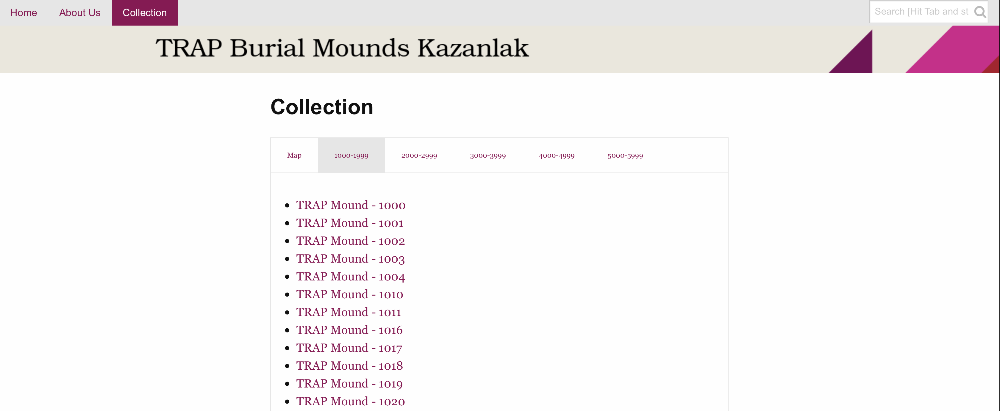
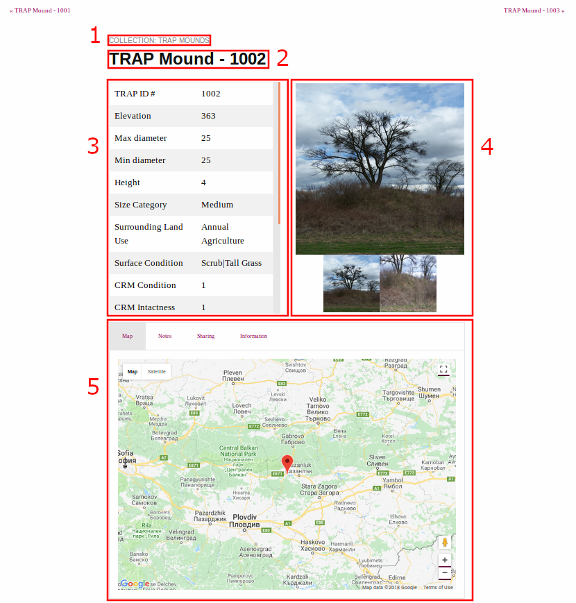

# README <!-- omit in toc -->

## Table of Contents

- [Table of Contents](#table-of-contents)
- [Introduction](#introduction)
- [Prerequisites](#prerequisites)
- [Software Prerequisites](#software-prerequisites)
  - [Required Python Modules](#required-python-modules)
  - [Installing Jekyll](#installing-jekyll)
    - [Running Jekyll Locally](#running-jekyll-locally)
- [Getting Started](#getting-started)
- [Uploading changes to Github](#uploading-changes-to-github)
- [Making changes on _config.yml and additional_config.yml](#making-changes-on-configyml-and-additionalconfigyml)
- [Configuration](#configuration)
- [Structure of the Project](#structure-of-the-project)
- [Preprocessing](#preprocessing)
  - [Preprocessing for Adding Images](#preprocessing-for-adding-images)
    - [File type for images](#file-type-for-images)
  - [Preprocessing Required for Linking Local Images](#preprocessing-required-for-linking-local-images)
  - [Preprocessing Required for Images on Google Drive](#preprocessing-required-for-images-on-google-drive)
  - [Adding categories](#adding-categories)
  - [Editing the Record Pages HTML Template](#editing-the-record-pages-html-template)
- [Displaying Map](#displaying-map)
- [Customization](#customization)
  - [Map Functionality for Records](#map-functionality-for-records)
    - [Markers for Record Maps](#markers-for-record-maps)
    - [Title of the Markers for Record Maps](#title-of-the-markers-for-record-maps)
  - [Adding Additional Metadata Inside the HTML head Tag](#adding-additional-metadata-inside-the-html-head-tag)
  - [Adding Additional Stylesheet or Javascript](#adding-additional-stylesheet-or-javascript)
  - [Search Functionality](#search-functionality)
  - [Excluding Files from Search](#excluding-files-from-search)
  - [Adding Images for a Record Page from Local Source](#adding-images-for-a-record-page-from-local-source)
  - [Adding Images for a Record Page from Google Drive](#adding-images-for-a-record-page-from-google-drive)
  - [Photo Gallery for Records](#photo-gallery-for-records)
- [Important Pages](#important-pages)
  - [Collections Page](#collections-page)
  - [Record Page Front Matter Template](#record-page-front-matter-template)
    - [Components of the Record Page HTML Template](#components-of-the-record-page-html-template)
- [Generating Record Pages](#generating-record-pages)
- [Record Page](#record-page)
- [Terminology](#terminology)

## Introduction

This is a template that uses [*Jekyll*](https://jekyllrb.com/) and is based off [feeling-responsive](https://github.com/Phlow/feeling-responsive-v2) theme by Phlow.

The purpose of this project is to generate a data-driven website from a CSV. Please also refer to the [Terminology section](#terminology).

To get started, please follow the steps in this README.

## Prerequisites

This project uses *Jekyll* as its static site generator, therefore users are highly recommended to have a basic understanding of *Jekyll*, please refer to [Jekyll official website](https://jekyllrb.com/docs/home/) for more information. The layout used in this project make use of front matter variables.

Users will need to have basic understanding of *Python3*, especially topics such as variables, *if* statements and function, in order to make modifications to the scripts provided in the *\_import* folder.

Also users will need to make modification to the *record.html* file to display their required front matter variables, therefore users will need to have a basic understanding of HTML, especially tables and some basic understanding of liquid templating to modify the layout for *record.html*.

It is recommended to also have basic understanding of CSS and Javascript, however it is not required if user wish to just generate a data driven website without any further customisation.

## Software Prerequisites

To run the Python scripts provided in the *\_import* folder, the user will need to have Python version 3.5.2 or above installed.

To test the website locally, the user will need to have Jekyll installed. It is also assumed that you are using Ubuntu operating system if you wish to test your website locally before uploading to Github Pages.

**NOTE:** If users do not have required Python Modules and attempt to run the Python scripts provided, they will receive errors. If errors occur, please install the required Python modules that are missing. Please refer to the [Required Python Module section](#required-python-modules) in regards to which modules are needed for the Python scripts provided.

Please refer to [Python3 documentation](https://docs.python.org/3/installing/index.html) if you need more information on Python modules and how to install Python modules.

[Back to TOC](#table-of-contents)

### Required Python Modules

The required modules to run the Python scripts in *\_import* folder are in the *requirements.txt* file. Please download the modules listed in that file.

[Back to TOC](#table-of-contents)

### Installing Jekyll

Please refer to [Jekyll official documentation](https://jekyllrb.com/docs/installation/) for instructions on how to install Jekyll on your system.

If you are using a Windows system, please refer to the page regarding installing [Jekyll on Windows](https://jekyllrb.com/docs/installation/windows/).

#### Running Jekyll Locally

Assuming Jekyll is installed, open up the terminal at the root of the folder of the project to see your website locally. Please enter the following command in the terminal:

```bash
bundle exec jekyll serve --config _config.yml,_config_dev.yml
```

Another option is to run the shell script *local\_jekyll\_build.sh* located at the root path of this project.

[Back to TOC](#table-of-contents)

## Getting Started

This section will briefly discuss the process required in this project where the outcome is a website created.
Please ensure that you have read the [Prerequisites section](#prerequisites) and the [Software Prerequisites section](#software-prerequisites) before you continue with the following steps.

1. Customise the project configuration options such as the title of the project, the logo, navigation bar that appears at the top of the page. Refer to [Configuration](#configuration) section for more information.
2. Using the *record.html* located inside the *\_layouts* folder as a template, work through the file and change it according to your requirements. Refer to the [Editing the Record Pages HTML Template section](#editing-the-record-pages-html-template) for more information.
3. Auto generate `record pages` using the script provided. Refer to the [Generating Record Pages section](#generating-record-pages) for more information.

[Back to TOC](#table-of-contents)

## Uploading changes to Github

This section is only relevant for users hosting their website on GitHub. Because this is a static website, every time users wish to push their changes (assuming the website is already on Github):

1. Delete the *\_posts* folder.
2. Recompile the `record pages` by running the *makeSite.py* Python script and additional scripts if needed.
3. `git add` then `git commit`, and finally `git push` to the remote repo.

## Making changes on _config.yml and additional_config.yml

If users are running Jekyll locally to see their changes, please stop the server, then re-run to see the changes made in the *\_config.yml* or *additional_config.yml* file.

[Back to TOC](#table-of-contents)

## Configuration

The *\_config.yml* file contains configuration options for the website. For basic configuration, do the following steps.

1. Open the *\_config.yml* file and work through it.
    - The main front matter variables for basic customisation is:
        - `title`
        - `slogan`
        - `description`
        - `credits`
        - `author`
        - `url`
        - `baseurl`
        - More details can be found on [GitHub article regarding Jekyll configuration](https://help.github.com/articles/configuring-jekyll/) and [Jekyll offical documentation configuration section](https://jekyllrb.com/docs/configuration/).
    - Rather than adding custom data directly into the *\_config.yml* file that can be accessed throughout the site via Liquid templating, users are recommended to add it into the *additional\_config.yml* file which is located in the *\_data* folder.
    - For example, the variable `google-map-marker` can be accessed via `site.data.additional_config.google-map-marker`.
    - Refer to [Jekyll datafile page](https://jekyllrb.com/docs/datafiles/) for more information.

2. Add your *logo.png* (if you have one) to the */assets/img/* folder.

3. Open *\_data/socialmedia.yml* and add your own social media links.

4. Open *\_data/navigation.yml* and customise your navigation.
  
    - A navigation link consist of 3 components, `title`, `url` and `side`.
  
      - `title` is the name of the link.
      - `url` is the relative link to the page.
      - `side` is whether the link would be located on the left-hand or right-hand side of the navigation bar. It is recommended to put the navigation links on the left hand side to keep the *Search* bar at its current location.

5. Open *\_data/language.yml* and translate the theme if necessary.

6. Open *\_data/services.yml* and customise links in the footer.

7. Open *\_data/authors.yml* and edit author information and set default author in config.yml.

[Back to TOC](#table-of-contents)

## Structure of the Project

This section will explain the structure of the project and describe the top-level folders for the project:

- _assets_ folder contain the CSS, Javascript used in the project and also images that are used for the site such as the logo and default images for `records`.
- *\_data* contains the configuration YAML files for the project.
- *\_images* folder contains the images used in the site.
- *\_import* contains scripts to generate `record pages` from a CSV and link images to the associated `record page`.
- *\_includes* contains content that can be included into files.
- *\_pages* contains pages of the website.
- *\_posts* contains the YAML files for the `record pages`.
- *\_sass* contains SASS partials of the project.
- *\_site* contains the generated site that Jekyll outputs. This folder is added into *.gitignore* file.

[Back to TOC](#table-of-contents)

## Preprocessing

Before generating `record pages`, ensure your data is well-formed for minimal hassle. A `record` should have a column that contains the unique identifier for that `record`.

[Back to TOC](#table-of-contents)

### Preprocessing for Adding Images

While it is possible to manually link the images to a `record page`, there are two other ways to link images to a `record page`.

  1. Link local images to `record pages` using the Python script *local_images.py* in the *\_import* folder. Please see the [preprocessing required for linking local images section](#preprocessing-required-for-linking-local-images) for more information.
  2. Read a CSV that contains Google Drive Links to images for `records` and write it to the associated `record page` using the *google_drive.py* Python script in the *\_import* folder.

[Back to TOC](#table-of-contents)

#### File type for images

Please ensure your images are in one of the following types so that the script is able to recognise the file as images:

  1. `.png`
  2. `.jpg`
  3. `.jpeg`

[Back to TOC](#table-of-contents)

### Preprocessing Required for Linking Local Images

First, please ensure your files are of the types discussed in the [file type section](#file-type-for-images), please otherwise convert your image to one of the file type mentioned in that section.

In the root folder of the project, create a folder called *images* if it doesn't exist yet. Inside the *images* folder, group the images by the unique identifier of the `record`. For each `record`, create a new folder inside the *images* folder with the name matching the unique identifier for that `record`.

**Example:**

For example, given a `record` with the unique id `1000` and the following images associated with that `record`:

- `1000_Detail_Profile_of_RT.JPG`
- `1000_Detail_RT2.JPG`
- `1000_Large_RT.JPG`
- `1000_Large_RT_Scale.JPG`
- `1000_Overview_S.JPG`
- `1000_Overview_year2009.JPG`
- `1000_RT.JPG`

The user will then need to create a new folder with the name `1000` and put all those images inside that folder. This results in the following structure:

```bash
images/
├── 1000
│   ├── 1000_Detail_Profile_of_RT.JPG
│   ├── 1000_Detail_RT2.JPG
│   ├── 1000_Large_RT.JPG
│   ├── 1000_Large_RT_Scale.JPG
│   ├── 1000_Overview_S.JPG
│   ├── 1000_Overview_year2009.JPG
│   ├── 1000_RT.JPG
```

[Back to TOC](#table-of-contents)

### Preprocessing Required for Images on Google Drive

First, please ensure your files are of the types mentioned in the [file type section](#file-type-for-images), otherwise convert your image to one of the file type discussed in that discussion.

To use the provided *google_drive.py* Python script, the URL of the Google Drive images will need to be extracted into a CSV. The script assumes that the length of the unique identifier is uniform, and that the unique identifier is appended to the start of the file name.

**Example:**

Assume a `record` with the unique identifier of `1000`  has 3 images associated with it:

- `image-one.jpg`
- `image-two.jpg`
- `image-three.jpg`

The user will then append `1000` to the filename of those images:

- `1000_image-one.jpg`
- `1000_image-two.jpg`
- `1000_image-three.jpg`

[Back to TOC](#table-of-contents)

### Adding categories

In the [Collections Page](#collections-page), `record pages` are grouped by categories.

In the following screenshot, there are 5 categories:
  
- `1000-1999`
- `2000-2999`
- `3000-3999`
- `4000-4999`
- `5000-5999`



Each category corresponds to a tab. For the purpose of this section, you can ignore the `map` tab, because it is not a category.

There are several pages listed under the `1000-1999` category, such as "TRAP Mound - 1000", "TRAP Mound - 1001". This is because of how the `records` are organized for this project, however your project could be different.

The `category` front matter variable determines on which category appears in the collection page and which category or categories the `record page` will be in.

**Example:**

```yml
---
...
title: TRAP Mound - 1000
record_id: '1000'
categories:
- 1000-1999
header: no
...

---

```

Notice that the `categories` front matter variable is a list that contains one value, `1000-1999`, this indicates that the `record page` will appear under the `1000-1999` category. It is possible to have a `record page` under multiple categories such as this:

```yml
categories:
- 1000-1999
- 2000-2999
```

This example above will make that `record page` appear in two categories, namely, `1000-1999` and `2000-2999`.

Please refer to [Collections Page section](#collections-page) for more details regarding the collection page.

[Back to TOC](#table-of-contents)

### Editing the Record Pages HTML Template

The `record pages` use *\_layout/record.html* as its layout. To modify the layout for `record pages`, users will need to understand the components of the file. Have a look at the components of the `record page` HTML, please see the [Components of the Record Page Template section](#components-of-the-record-page-html-template).

[Back to TOC](#table-of-contents)

## Displaying Map

This project uses [Google Map Javascript API](https://developers.google.com/maps/documentation/javascript/tutorial). If the user wishes to use Google Map API for this project, please go to Google Map website and get a API key, then go to *additional_config.yml* and set the value of the variable `javascript_google_map` to `true`.

**Example:**

```yml
javascript_google_map: true
```

## Customization

Before auto generating `record pages`, the user can customise the site. This section will discuss some customizations available to the user.

[Back to TOC](#table-of-contents)

### Map Functionality for Records

The map functionality for `records` is split into several components:

1. The `div` element with the id `record_map` is located in the *record.html* file inside the *\_layouts* folder. The element has 3 attributes which store the title, latitude and longitude of that `record`.
2. The CSS required for the styling of the `div` element which is in the sass file *\_google\_maps.scss*.
3. The Javascript function that uses the Maps Javascript API. This is located in the *\_custom_js/record\_pages\_map.js* and importing that script is located in the *\_includes/additional\_helper/additional\_footer.html* file.

The default setting for the map functionality is that it uses the `latitude` and `longitude` front matter variables of the `record page`. So if users wish to have a map, the column name in the CSV must also correspond to that name.

**NOTE:** It is fine to have the column names "Latitude" and "Longitude" in the CSV, because the script that generates a page for each row then converts the column names to lowercase when it passes it into the front matter for the `record page`.

- **IMPORTANT:** The format of the coordinates should also be in *decimal degrees* which is what Google Map API uses.

[Back to TOC](#table-of-contents)

#### Markers for Record Maps

The `google-map-marker` variable in the *additional\_config.yml* file is used to determine whether to add a marker that points to the location of the `record`. If the user does not wish to have a Google Map marker then the user can edit the `google-map-marker` variable and change the value from *true* to *false*, and if they wish to have the marker back then they would reverse it, changing the value from *false* to *true*.

[Back to TOC](#table-of-contents)

#### Title of the Markers for Record Maps

The `title` front matter variable in the `record page` is used as the title of the Google Map marker.

[Back to TOC](#table-of-contents)

### Adding Additional Metadata Inside the HTML head Tag

In the *\_includes/helper* folder, there is a HTML file called *head.html*. This contains all the default information about the page inside the `<head>` tags.

If the user wants to add additional information enclosed inside the `<head>` tag, it is recommended to add it into the *additional\_head.html* file to distinguish between the default metadata and the new metadata defined by the user. The additional metadata will be added after the default metadata because we are using Jekyll `include` tag to include the content from *additional\_head.html* into the *head.html* file. However, the user is free to modify the *head.html* file.

[Back to TOC](#table-of-contents)

### Adding Additional Stylesheet or Javascript

For users that wish to customise the styling and behavior of their website by adding additional stylesheet or Javascript, please refer to the [additional additional javascript or stylesheet document](adding-additional-javascript-or-stylesheet.md) for more information.

[Back to TOC](#table-of-contents)

### Search Functionality

The current search function allows the user to search `records` by `title` and `record_id` variables. If users wish to customise their search, please read this [tutorial](https://learn.cloudcannon.com/jekyll/jekyll-search-using-lunr-js/) which is used as the starting point to implement searching in this project.

- *pages/search.md* is the file which contains the search data.
- *assets/js/search.js* is the file which contains the Javascript logic to perform the search.

[Back to TOC](#table-of-contents)

### Excluding Files from Search

To explicitly exclude a page from search result, please add `exclude_from_lunr` variable to the page front matter and set the value to `true` with no surrounding quotes, that means, `"true"` or `'true'` is not correct.

**Example: Correct value**

```yml
exclude_from_lunr: true
```

**Example: Incorrect values**

```yml
exclude_from_lunr: "true"
```

```yml
exclude_from_lunr: 'true'
```

[Back to TOC](#table-of-contents)

### Adding Images for a Record Page from Local Source

Please ensure to read and follow the instructions provided in the [preprocessing required for linking local images section](#preprocessing-required-for-linking-local-images) before proceeding with this section.

Please follow the steps listed below:

1. If you have run the *make_site.py* Python script to generate the `record pages`, then you can skip this step, please otherwise read the [generating `record pages` section](#generating-record-pages) and follow the instructions in that section.
2. Run the *local_images.py* Python script. Once that is done, you have finished linking images from the *images\/* folder to its associated `record page`.

Once you have finished all the steps, run the website to test if the images were successfully associated with the `record page`.  

[Back to TOC](#table-of-contents)

### Adding Images for a Record Page from Google Drive

Please ensure to read the [Generating Google Drive Link to CSV page](_import/generating-google-drive-link-CSV.md) to generate the CSV that contains the Google Drive CSV.

Once you have the generated CSV, please follow the following steps:

  1. Ensure that the CSV file is in the *\_import* folder.
  2. Ensure the value for the key `google_drive_csv_file` in [customizable-variables.yaml](_import/customizable-variables.yaml) is the same as the file name of the CSV with the Google Drive Links.
  3. If you have run the *make_site.py* Python script to generate the `record pages`, you can skip this step and move onto step 4, otherwise, please read the [Generating Record Pages section](#generating-record-pages) and follow the instructions in that section.
  4. Run the *google_drive.py* Python script. Once that is done, you have finish adding images from Google Drive.

Once you have finish all the steps, run the website to test if the images were successfully associated with the `record page`.

[Back to TOC](#table-of-contents)

### Photo Gallery for Records

The photo gallery is implemented using [slick](http://kenwheeler.github.io/slick/). There are two photo galleries in a `record page`, one is used to display photos for that `record` and the second is used as a navigation. The implementation is split into three parts:

1. The HTML structure is defined in the template HTML page for the `records`, which by default is in *\_layouts/record.html*.
2. The CSS that is used to style the photo gallery such as the the navigation buttons for the photo gallery is in *assets/slick/slick-theme.css*.
3. The Javascript is used to define the logic of the photo gallery is in *assets/custom_js/slick-settings.js*.

[Back to TOC](#table-of-contents)

## Important Pages

### Collections Page

The *\_pages/pages-root-folder/collections.md* is the web page that is used to display the links to all the `record pages`. The organization of the pages is grouped by `categories` where one tab corresponds to a `category`. A `record page` can appear in one or more `category`. To add a `record page` under a `category`, add the name of the category in the YAML list for that `record page` under the `categories` key.

If the user wishes to change the content of the page, they can edit the *collections.md* file in the *\_pages/pages-root-folder/* folder.

[Back to TOC](#table-of-contents)

### Record Page Front Matter Template

The YAML template for `record pages` is the *\_import/template.yaml* file. The script that will generate `record pages` will use that as a template for the `record pages`.
The layout file that *\_import/template.yaml* uses is the *\_layout/record.html* file.

[Back to TOC](#table-of-contents)

#### Components of the Record Page HTML Template



1. Subheadline
2. Title
3. Table
4. Photo gallery
5. Content tabs

[Back to TOC](#table-of-contents)

## Generating Record Pages

1. Edit the [customizable-variables.yaml](_import/customizable-variables.yaml) files to suit your requirements.
2. customise the *category_generation.py* to your requirements. Refer [here](_import/README.md) for more information regarding the script. Refer to [Adding Categories section](#adding-categories) for more information about `categories`.
3. Open your terminal and install the required dependencies listed in the *requirements.txt* file.
4. Run the Python3 script *makeSite.py*.

The rest of this section will discuss how to generate `record pages` in detail.

In the *\_import* folder there is a Python script named *makeSite.py*. The purpose of the script is to generate a separate YAML file for each row in the CSV. Each column corresponds to a front matter variable in the YAML file. The variable will be the name of the column with all space characters replaced with the underscore character `_` and the characters are converted to all lowercase (**EXCEPT** the unique identifier) .

**NOTE:** The unique identifier will be stored into the front matter variable `record_id`. You would need to provide the column name (case-sensitive) so that the script can extract the id for the `record`.

**Example:**

There is a CSV file with 3 columns, '_TRAP ID_', '_Max diameter_', '_Surrounding Land Use_', where the values are respectively 1000, 34, "Annual Agriculture" for a row. Then in the corresponding `record page` for that row, the front matter variable will be in the following format. If we choose '_TRAP ID_' as the `record_id`, the following code snippet will be the result.

```yml
record_id: '1000'
max_diameter: '34'
surrounding_land_use: Annual Agriculture
```

[Back to TOC](#table-of-contents)

## Record Page

A `record page` is a page in the *\_post* folder. It contains front matter variables which store the attributes of that `record`. The front matter variables are enclosed between triple dashes.

Here is a simple example:

```YML
---
layout: record
title: TRAP Mound - 1000

record_id: '1000'
---
```

In the example above, there are three front matter variable, namely `layout`, `title`, and `record_id`. The front matter variables are used by the template to display data specific to that `record`.

**NOTE:** The front matter variables must be the first thing in the file.

[Back to TOC](#table-of-contents)

## Terminology

- `record`: a row in the CSV.
- `record page`: a markdown page that contains front matter variables, where a front matter variable corresponds to a column and its value for that `record`.
  - A [*post*](https://jekyllrb.com/docs/posts/) in Jekyll is in our case a `record page`.
- `attribute`: a column in the CSV.
  

[Back to TOC](#table-of-contents)